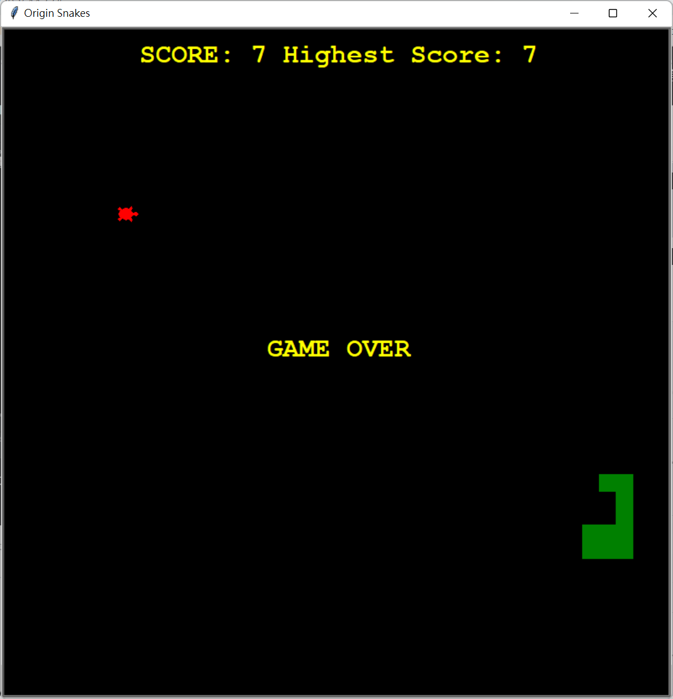

# <Strong>_Description_</Strong>

This game is similar with origin snake game.

The player used "W","A","S","D" to control the snake. The snake would grow up when it reach the turtle. The target is making the snake as long as you can. On the other hand, when you reach the border or the head hit the body,the game would be over.

 

# <Strong>_Tools & Git page_</Strong>

 
 
<strong>Git page: **https://github.com/LeonTsai2021 **</strong> 
 

 

# <Strong>_Features_</Strong>

## <Strong>_Home_</Strong>
The data.txt would record the Highest score before.

## <Strong>_Game over_</Strong>

 
